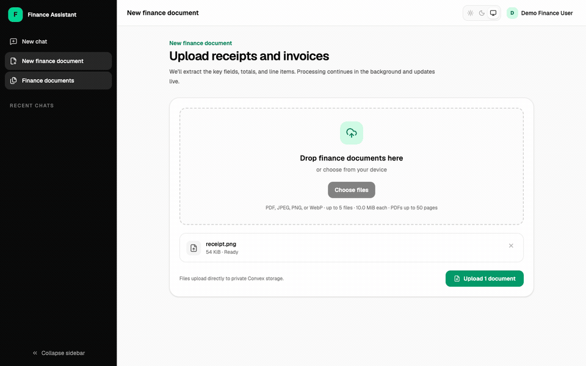

# Finance Document Assistant

A private, source-grounded assistant for receipts and invoices. Upload finance
documents, review validated structured data, ask questions in natural language,
and receive deterministic totals, tables, and charts linked back to the original
files.



## Highlights

- Direct PDF, PNG, JPEG, and WebP uploads to private Convex File Storage.
- Asynchronous AI extraction with strict schema, arithmetic, and file-signature
  validation.
- PDF text inspection, page rendering, vision fallback, batching, and
  reconciliation for difficult invoices.
- Editable receipt and invoice fields with evidence, page references, audit
  history, duplicate detection, retry, and deletion.
- Grounded finance chat backed by read-only, user-scoped tools rather than the
  model receiving an unrestricted data dump.
- Deterministic spending, supplier, tax, outstanding-invoice, period-comparison,
  and chart calculations.
- Email/password, Google, and GitHub authentication through Better Auth.
- Per-account quotas, transactional rate limits, retention controls, data
  export, account deletion, sanitized operational events, and failure alerts.

## Stack

- React 19 and TanStack Start
- Tailwind CSS and shadcn/ui conventions
- Convex database, functions, scheduling, storage, and realtime subscriptions
- Better Auth with the Convex component
- Vercel AI SDK and AI Gateway
- Convex Agent and Rate Limiter components
- Zod validation and TanStack Charts
- Vitest, `convex-test`, and Playwright

## Local development

Requirements: Node.js 22+, pnpm 11+, and a Convex account.

```bash
pnpm install
cp .env.example .env
pnpm convex dev
```

Complete the values in `.env`, including `BETTER_AUTH_SECRET`, the OAuth client
credentials, and `AI_GATEWAY_API_KEY`. Keep `pnpm convex dev` running, then start
the application in another terminal:

```bash
pnpm dev
```

Open [http://localhost:8080](http://localhost:8080).

Google and GitHub OAuth callbacks use:

```text
http://localhost:8080/api/auth/callback/google
http://localhost:8080/api/auth/callback/github
```

Do not commit `.env`. Convex deployment variables are separate from local shell
variables; synchronize required backend values with `pnpm convex env set`.

## Useful commands

```bash
pnpm dev          # Start TanStack Start on port 8080
pnpm convex dev   # Develop and deploy Convex functions
pnpm check        # Types, lint, formatting, and unit/integration tests
pnpm test:e2e     # Desktop and mobile Playwright checks
pnpm build        # Production build
pnpm readme:demo  # Recreate the README screenshots and animated GIF
```

The README demo command requires Google Chrome, `ffmpeg`, configured local and
Convex environments, and access to the development deployment. It uses the real
`tests/fixtures/phase0/receipt.png`, creates an isolated temporary account,
captures five application states, and then requests account deletion. If the AI
Gateway is unavailable or rate-limited, the capture script completes that known
test fixture through the same strict persistence validator using its
permission-safe expected values.

## Architecture

1. The browser obtains a short-lived upload URL and sends file bytes directly
   to Convex File Storage.
2. An authenticated mutation validates metadata, enforces quotas, creates the
   document/job records, and schedules processing.
3. A Convex Node action validates the file, calls the selected AI model, applies
   deterministic validation, and persists a reviewable result.
4. Chat uses bounded, owner-scoped finance tools. The model chooses a tool, but
   totals and chart data are calculated by application code.
5. Realtime Convex queries update document and chat screens as work progresses.

## Documentation

- [Product and technical plan](docs/plan.md)
- [Phase 7 production hardening](docs/phase-7-production-hardening.md)
- [Privacy and data controls](docs/privacy.md)
- [Production readiness checklist](docs/production-readiness.md)

## Security notes

All public data operations derive ownership from the authenticated Convex
identity. Document content is treated as untrusted input, including instructions
printed inside uploaded files. AI requests disable prompt training through the
Gateway provider options; zero-data-retention routing can be enabled separately
when the selected plan and provider support it.

This project handles sensitive financial documents. Review the production
checklist, provider retention terms, OAuth settings, budgets, alert routing, and
deployment secrets before using it with real financial data.
