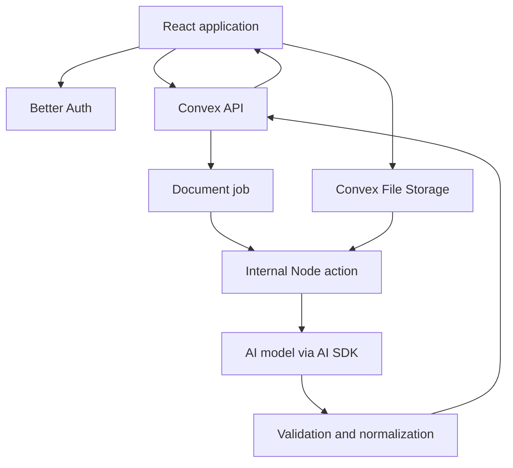
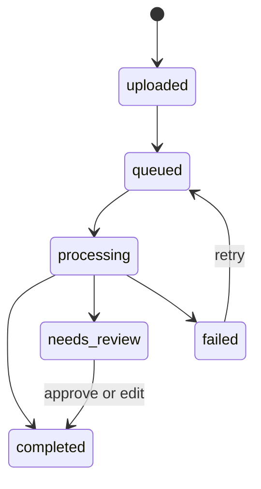

# Finance Document Assistant — Product and Technical Plan

## 1. Product goal

Build a personal finance document assistant where an authenticated user can:

- Upload receipts and invoices as PDF, PNG, JPEG, or WebP files.
- Have uploaded documents processed asynchronously into validated structured data.
- Browse, filter, inspect, correct, and delete their finance documents.
- Chat with an assistant about the financial information contained in their documents.
- Receive tables and interactive charts when a visual answer is useful.
- See the source documents and evidence behind answers.

This plan uses Convex for the database, file storage, queries, mutations, actions, HTTP actions, scheduling, and realtime UI updates.

## 2. Locked technology choices

| Area                         | Choice                                                                 |
| ---------------------------- | ---------------------------------------------------------------------- |
| Frontend framework           | React with TanStack Start                                              |
| Routing and server rendering | TanStack Start                                                         |
| Styling                      | Tailwind CSS                                                           |
| UI components                | shadcn/ui                                                              |
| Charts                       | TanStack Charts                                                        |
| Authentication               | Better Auth                                                            |
| Authentication methods       | Email/password, Google OAuth, GitHub OAuth                             |
| Application database         | Convex                                                                 |
| File storage                 | Convex File Storage                                                    |
| Backend functions            | Convex mutations, queries, actions, internal actions, and HTTP actions |
| AI orchestration             | Vercel AI SDK                                                          |
| Structured validation        | Zod                                                                    |
| AI execution environment     | Convex internal Node actions                                           |

## 3. Architectural principles

1. Upload file bytes directly from the browser to Convex File Storage using a generated upload URL.
2. Record the user's intent and document metadata in a Convex mutation before starting processing.
3. Schedule document processing as an internal Node action; do not hold the upload request open while AI work runs.
4. Download private file bytes from Convex inside the action and submit bytes to the model. Do not depend on permanent public file URLs.
5. Try whole-document extraction first for ordinary receipts and invoices.
6. Use text extraction, rasterization, OCR, page batching, and reconciliation only when the direct path is unsupported or unreliable.
7. Treat model output as untrusted input: validate its schema, arithmetic, ownership, and business rules.
8. Preserve provenance so every extracted fact can be traced back to a document and page.
9. Make all chat data tools user-scoped and read-only unless the user explicitly initiates a separate mutation flow.
10. Version schemas and prompts so old documents can be reprocessed safely.

## 4. System overview



### Runtime responsibilities

#### React/TanStack Start

- Authentication screens and protected routes.
- Direct file uploads with progress.
- Realtime document processing status.
- Finance-document browser and review UI.
- Chat interface, streamed assistant responses, tool states, tables, and charts.
- Light/dark theme and responsive application shell.

#### Convex queries and mutations

- Authorization and user-scoped data access.
- Generate file upload URLs.
- Register uploaded files and create durable processing jobs.
- Persist normalized extraction results.
- Manage chat threads and message metadata.
- Aggregate financial data for deterministic AI tools.

#### Convex internal Node actions

- Retrieve files from Convex File Storage.
- Call models through the Vercel AI SDK.
- Render or OCR pages when necessary.
- Retry recoverable failures.
- Execute multi-step invoice processing when necessary.
- Call internal mutations to persist progress and results.

#### Convex HTTP actions

- Better Auth endpoints and callbacks as required by the integration.
- Chat streaming endpoint if the selected Convex/AI SDK streaming integration needs HTTP transport.
- External webhooks if introduced later.
- HTTP actions must not become the primary long-running document worker.

## 5. User experience and routes

### Public routes

#### `/sign-in`

- Email and password form.
- Google sign-in button.
- GitHub sign-in button.
- Link to account creation.
- Forgot-password entry point when password recovery is implemented.

#### `/sign-up`

- Name, email, password, and password confirmation.
- Google sign-up button.
- GitHub sign-up button.
- Terms/privacy acknowledgement if required.
- Link back to sign-in.

### Protected application shell

The authenticated experience uses a ChatGPT-style three-area layout:

#### Left sidebar

- Product identity.
- `New chat` primary action.
- `New finance document` upload action.
- `Finance documents` navigation item.
- Recent chat list grouped by time.
- Collapse/expand control on desktop.
- Sheet/drawer presentation on mobile.

#### Top bar

- Current thread or page title.
- Light/dark/system theme switch.
- User menu.
- Logout button.

#### Main content

- Current chat thread, finance-document collection, upload flow, or document detail.

### Protected routes

| Route                        | Purpose                                            |
| ---------------------------- | -------------------------------------------------- |
| `/app`                       | Redirect to the newest chat or an empty chat state |
| `/app/chat/new`              | Start a new conversation                           |
| `/app/chat/$chatId`          | Current chat thread                                |
| `/app/documents`             | Finance-document list and filters                  |
| `/app/documents/new`         | Upload finance documents                           |
| `/app/documents/$documentId` | Document details, extraction, evidence, and review |
| `/app/settings`              | Profile and account settings, if included in MVP   |

## 6. Upload experience

### Accepted inputs

- PDF: `application/pdf`
- Images: `image/jpeg`, `image/png`, `image/webp`
- Initial size and page limits must be configurable.
- MIME type, filename extension, and file signature should be checked.
- Multiple-file upload can be supported, but each file creates an independent document and processing job.

### Browser upload sequence

1. User drops or selects one or more files.
2. Client validates obvious type and size errors.
3. Client calls an authenticated Convex mutation to generate an upload URL.
4. Client posts file bytes directly to the generated URL.
5. Convex returns a storage ID.
6. Client calls `registerDocument` with the storage ID, original filename, MIME type, and size.
7. The mutation inserts the document and job records and schedules the internal processing action.
8. Client navigates to the document page and subscribes to its status.

### Upload UI states

- Selected
- Uploading with percentage
- Uploaded
- Queued
- Processing
- Needs review
- Completed
- Failed with retry action

## 7. Document processing strategy

### Default path: one complete-document request

Use this path for ordinary receipts and invoices that fit the selected provider's file and page limits:

1. Retrieve the `Blob` with `ctx.storage.get(storageId)`.
2. Convert it to `Uint8Array` or `ArrayBuffer`.
3. Send the image or PDF as a Vercel AI SDK file/image part.
4. Request a typed result with `generateText` and `Output.object({ schema })`.
5. Validate and normalize the returned object.
6. Run deterministic arithmetic and consistency checks.
7. Persist the result or mark it `needs_review`.

This is the MVP path and should be evaluated against a representative test set before adding complexity.

### Adaptive fallback path

Use fallback processing when:

- The provider cannot consume the source PDF.
- A page has no usable text and cannot be interpreted reliably.
- The PDF exceeds model limits.
- It contains multiple invoices or unrelated attachments.
- Extraction validation fails after a limited retry.
- A large multi-page table is incomplete or inconsistent.

Fallback stages:

1. Inspect the PDF and identify pages.
2. Extract embedded text where useful.
3. Render scan-only or problematic pages to images at an appropriate DPI.
4. OCR or use vision extraction for those pages.
5. Process pages or page batches into partial structured results.
6. Run a reconciliation step that combines headers, line items, totals, and evidence.
7. Deduplicate repeated headers and line items at page boundaries.
8. Run final schema and arithmetic validation.

### Document classification

Each document should be classified as:

- `receipt`
- `invoice`
- `credit_note`
- `unknown`

The classifier may be part of a combined extraction schema for simple documents. Split classification into a separate call only if testing shows that combined extraction is unreliable.

### Processing state machine



Additional internal stages can be recorded separately: `downloading`, `classifying`, `extracting`, `ocr`, `reconciling`, and `validating`.

## 8. Structured finance data

### Common document fields

- Document type
- Merchant or supplier name
- Supplier address
- Supplier tax/VAT identifier
- Customer name and address when present
- Invoice or receipt number
- Issue date
- Due date
- Currency as ISO code when determinable
- Payment status when explicitly present or recorded by the user
- Payment method when present
- Subtotal
- Discount
- Tax total
- Grand total
- Line items
- Category and tags
- Notes and warnings
- Extraction confidence/review state
- Evidence page for important fields

### Line-item fields

- Description
- Quantity
- Unit
- Unit price
- Discount
- Tax rate
- Tax amount
- Line total
- Suggested category
- Source page

### Extraction rules

- Missing values must be `null`, never invented.
- Preserve printed identifiers as strings.
- Monetary values are stored in minor units where practical to avoid floating-point errors.
- Store the original printed value or evidence where normalization could be ambiguous.
- Dates use an ISO normalized value plus the original printed text when ambiguity exists.
- Currency must not be guessed from language alone without recording a warning.
- Credit notes, refunds, and discounts must have consistent sign conventions.

## 9. Deterministic validation

Zod validates the shape but not the financial truth. Apply checks such as:

- Sum of line totals approximately equals subtotal.
- Subtotal minus discount plus tax approximately equals total.
- Due date is not earlier than issue date unless explicitly printed that way.
- Currency is consistent across extracted monetary fields.
- Invoice number and supplier are not blank for an invoice marked complete.
- Duplicate processing does not insert duplicate line items.
- Page references fall within the document's page count.

Use a currency-aware tolerance and minor-unit arithmetic. Failed checks should normally produce `needs_review`, not silently corrected values.

## 10. Convex data model

Exact Better Auth tables will follow the chosen Better Auth Convex adapter. Application tables should include the following.

### `documents`

```ts
{
  ownerId,
  storageId,
  originalFilename,
  mimeType,
  byteSize,
  sha256?,
  documentType,
  status,
  processingStage?,
  schemaVersion,
  pageCount?,
  merchantOrSupplierName?,
  documentNumber?,
  issueDate?,
  dueDate?,
  currency?,
  subtotalMinor?,
  taxMinor?,
  totalMinor?,
  categoryId?,
  tags?,
  needsReview,
  createdAt,
  updatedAt
}
```

Indexes:

- By owner and creation date.
- By owner and status.
- By owner and issue date.
- By owner and document type.
- By owner and supplier.
- Optional deduplication index using owner, hash, and schema version.

### `documentLineItems`

```ts
{
  ownerId,
  documentId,
  position,
  description,
  quantity?,
  unit?,
  unitPriceMinor?,
  discountMinor?,
  taxRateBasisPoints?,
  taxMinor?,
  totalMinor?,
  categoryId?,
  sourcePage?,
  createdAt
}
```

### `documentExtractions`

Keep immutable processing snapshots for auditability and reprocessing:

```ts
{
  ownerId,
  documentId,
  attempt,
  schemaVersion,
  promptVersion,
  model,
  rawStructuredOutput,
  normalizedOutput?,
  warnings,
  validationErrors,
  usage?,
  createdAt
}
```

Do not store hidden model reasoning. Store only application-visible outputs, evidence, provider metadata, and usage needed for operations.

### `documentJobs`

```ts
{
  ownerId,
  documentId,
  status,
  stage,
  attempt,
  idempotencyKey,
  startedAt?,
  completedAt?,
  nextRetryAt?,
  errorCode?,
  safeErrorMessage?,
  createdAt,
  updatedAt
}
```

### `documentPages` — optional for fallback processing

```ts
{
  ownerId,
  documentId,
  pageNumber,
  extractionSource,
  text?,
  ocrConfidence?,
  renderedImageStorageId?,
  createdAt
}
```

Rendered page images should normally have a short retention period unless they are needed for review.

### `categories`

User-owned or built-in categories with name, icon, color, and type.

### `chats`

```ts
{
  ownerId,
  title,
  lastMessageAt,
  createdAt,
  updatedAt,
  archivedAt?
}
```

### `chatMessages`

```ts
{
  ;(ownerId, chatId, role, content, parts, status, createdAt)
}
```

Persist only the message/tool-part format required for reconstructing the chat UI. Large generated datasets should be referenced rather than copied into every message.

### `chartArtifacts`

```ts
{
  ownerId,
  chatId,
  messageId,
  chartType,
  title,
  xKey,
  series,
  data,
  currency?,
  createdAt
}
```

Validate chart specifications server-side before rendering them.

## 11. Authentication and authorization

### Better Auth

- Email/password registration and login.
- Google OAuth.
- GitHub OAuth.
- Secure session handling through the selected Better Auth and Convex integration.
- Email verification and password reset should be included before public launch.
- Account linking behavior must be explicitly configured to avoid duplicate users.

### Authorization rules

- Every document, file reference, job, extraction, line item, chat, message, and chart belongs to an `ownerId`.
- Every public Convex query and mutation checks the authenticated identity.
- Internal functions receive stable owner/document identifiers but still verify ownership where appropriate.
- Storage IDs and document IDs are identifiers, not authorization credentials.
- A user must never be allowed to query another user's documents through an AI tool.
- OAuth secrets and AI-provider keys live only in backend environment variables.

## 12. Chat architecture

### Chat request flow

1. React submits a message for a selected chat.
2. Backend verifies ownership of the chat.
3. User message is persisted.
4. A Vercel AI SDK request runs with finance tools available.
5. The model invokes only the tools required to answer the question.
6. Tool functions call internal, authenticated Convex queries or deterministic aggregation code.
7. Assistant text and tool results stream to the UI where supported.
8. Final assistant message and any chart artifact are persisted.

### Context strategy

Do not place every document into the prompt. The assistant should retrieve only relevant data through tools.

Prompt context should include:

- Current user identity as a trusted server-side scope, not prompt text supplied by the client.
- Current date and user locale/time zone where needed.
- Recent conversation turns within a controlled context window.
- Summaries of older turns when needed.
- Tool descriptions and finance calculation rules.

## 13. Vercel AI SDK tools

All tools must use a Zod input schema, return a bounded JSON result, enforce the authenticated owner scope server-side, and avoid arbitrary database query generation.

### Core read tools

#### `searchFinanceDocuments`

Search documents by date range, supplier/merchant, document type, category, status, tags, amount range, or text query.

#### `getFinanceDocument`

Return one authorized document's normalized fields, line items, warnings, and evidence references.

#### `getSpendingSummary`

Aggregate expenses by day, week, month, quarter, category, merchant, currency, or document type.

#### `getIncomeAndExpenseSummary`

Return deterministic totals for income, expenses, tax, net amount, and optionally outstanding invoices over a defined period.

#### `getSupplierSummary`

Aggregate totals, invoice count, average value, outstanding amounts, and recent activity for suppliers.

#### `getTaxSummary`

Aggregate recorded tax amounts by period, rate, category, and currency. The assistant must state that this is document-derived information, not tax advice.

#### `getOutstandingInvoices`

Return invoices whose stored payment state and due date indicate open, overdue, or upcoming obligations. Do not infer that an invoice is unpaid solely because a payment receipt was not uploaded.

#### `comparePeriods`

Perform deterministic comparison between two user-specified periods, including absolute and percentage changes.

#### `getChartData`

Return a validated chart-ready structure derived from a deterministic finance aggregation. The model chooses the analytical intent, while backend code controls the query and calculations.

Example return shape:

```ts
{
  chartType: "bar" | "line" | "area" | "pie",
  title: string,
  xKey: string,
  series: Array<{
    key: string,
    label: string,
    colorToken?: string
  }>,
  data: Array<Record<string, string | number>>,
  currency?: string,
  notes?: string[]
}
```

### Mutation tools

For MVP, chat tools should not modify finance documents. Editing, deleting, categorizing, marking invoices paid, or retrying extraction should be explicit UI actions backed by normal Convex mutations and confirmation flows.

If mutation tools are introduced later, every impactful action must require clear confirmation and use an idempotency key.

## 14. Chart behavior

Use charts only when the question involves a useful numeric relationship such as:

- Spending over time.
- Spending by category.
- Supplier concentration.
- Tax over time.
- Paid versus outstanding invoice amounts.
- Current period versus previous period.

### Rendering flow

1. Model recognizes that a chart would help.
2. Model calls a deterministic aggregation tool.
3. Tool returns validated chart data, not executable JavaScript.
4. Chat message stores a chart artifact reference.
5. React renders the specification using TanStack Charts.
6. A table or textual summary remains available for accessibility.

The model must never generate arbitrary chart component code for the client to execute.

### Currency behavior

- Never sum different currencies into one total without an explicit conversion strategy.
- MVP should group results by currency.
- Currency conversion can be added later with a stored exchange-rate source, timestamp, and disclosure.

## 15. Document detail and review screen

The document page should include:

- Original PDF/image preview.
- Processing status and warnings.
- Supplier/merchant and core metadata.
- Totals and currency.
- Editable line-item table.
- Extraction evidence and source page numbers.
- Validation warnings.
- Approve/save changes action.
- Retry processing action after failure.
- Delete action with confirmation.
- Audit metadata such as upload time and last processing time.

Manual edits should not be overwritten silently by future automatic reprocessing. Record whether a field is model-extracted or user-confirmed.

## 16. Finance-document list

Features:

- Search by merchant/supplier or document number.
- Filter by date range, document type, status, review state, category, and currency.
- Sort by issue date, upload date, amount, or supplier.
- Table on desktop and compact cards on mobile.
- Multi-select can be deferred unless needed for the first release.
- Empty, loading, error, and no-results states.

## 17. Security and privacy

- Files remain private in Convex File Storage.
- Backend actions retrieve bytes only after authorization and job validation.
- Do not log complete document text, file bytes, auth tokens, signed URLs, or sensitive model prompts.
- Redact provider errors before exposing them to users.
- Validate file signatures and size before processing.
- Consider malware scanning before public or enterprise deployment.
- Rate-limit uploads, processing retries, chat requests, and expensive tools.
- Implement configurable file and data retention/deletion.
- Deleting an account must delete or schedule deletion of owned files and records.
- Document which AI provider receives files and configure provider data-retention settings appropriately.

## 18. Reliability and cost controls

- Use `ownerId + fileHash + schemaVersion` or a generated job key for idempotency.
- Use bounded retries with exponential backoff for transient provider errors.
- Do not retry unsupported files or deterministic validation failures indefinitely.
- Record processing stage and safe failure code.
- Limit concurrent processing per user.
- Set maximum files, bytes, pages, model input size, output line items, and tool result size.
- Record model, prompt version, token usage, latency, and estimated cost when available.
- Use a representative golden test set of receipts and invoices.
- Require human review when totals disagree or essential fields are missing.

## 19. Suggested project organization

```text
src/
  components/
    app-shell/
    auth/
    chat/
    charts/
    documents/
    ui/
  routes/
    sign-in.tsx
    sign-up.tsx
    app.tsx
    app.chat.$chatId.tsx
    app.documents.index.tsx
    app.documents.new.tsx
    app.documents.$documentId.tsx
  lib/
    auth-client.ts
    auth-server.ts
    chart-spec.ts
    currency.ts
    validations.ts
convex/
  auth.config.ts
  auth.ts
  convex.config.ts
  http.ts
  schema.ts
  documents.ts
  documentQueries.ts
  documentMutations.ts
  documentProcessing.ts
  documentValidation.ts
  chats.ts
  chatActions.ts
  financeTools.ts
  internal/
    documentJobs.ts
    documentWrites.ts
shared/
  financeSchemas.ts
  aiSchemas.ts
  constants.ts
```

Names can be adjusted to the final TanStack Start and Convex conventions, but shared Zod schemas should remain independent of UI components.

### Project setup baseline

The repository is scaffolded before phase implementation with the same proven
integration shape as the sibling `code-chat` project:

- pnpm workspace and scripts for development, build, lint, formatting, type
  checking, and tests.
- TanStack Start with Vite, React, Tailwind CSS, and shadcn/ui configuration.
- TanStack Query connected to Convex through `ConvexQueryClient`.
- `ConvexBetterAuthProvider` at the router boundary so authenticated Convex
  requests receive Better Auth tokens.
- Better Auth browser and TanStack Start server adapters under `/api/auth`.
- The Better Auth Convex component mounted in `convex/convex.config.ts`, with
  its JWT provider in `convex/auth.config.ts` and HTTP routes in
  `convex/http.ts`.
- Typed Convex environment declarations and a safe `.env.example`; local and
  deployed secrets must be configured separately and never committed.

The setup intentionally does not implement phase behavior or application data
tables. After review, initialize a Convex deployment, populate the local and
Convex environment variables, and run Convex code generation before beginning
the phase checklists.

## 20. Implementation phases

### Phase 0 — validation spike

- [x] Select the first AI model/provider.
- [x] Collect a small, permission-safe test set of representative images and PDFs.
- [x] Prove Convex action file retrieval and AI SDK PDF/image input.
- [x] Define receipt and invoice Zod schemas.
- [x] Measure whole-document extraction accuracy, latency, and cost.
- [x] Decide initial file/page limits and conditions for fallback processing.

See [`phase-0-validation.md`](./phase-0-validation.md) for the decisions,
fixtures, and measured results.

Exit criterion: common receipts and short invoices extract reliably enough to proceed.

### Phase 1 — foundation and authentication

- [x] Create TanStack Start application.
- [x] Configure Tailwind and shadcn/ui.
- [x] Configure Convex schema and client.
- [x] Integrate Better Auth.
- [x] Add email/password, Google, and GitHub authentication.
- [x] Protect application routes.
- [x] Implement application shell, sidebar, top bar, theme, and logout.

Exit criterion: users can create accounts, sign in, sign out, and access only their protected shell.

### Phase 2 — upload and document lifecycle

- [x] Build upload screen and drop zone.
- [x] Generate Convex upload URLs.
- [x] Store files and register documents.
- [x] Create jobs and schedule internal processing actions.
- [x] Show realtime upload/processing state.
- [x] Implement whole-document receipt/invoice extraction.
- [x] Add schema and arithmetic validation.
- [x] Build document list and basic document detail.

See [`phase-2-document-lifecycle.md`](./phase-2-document-lifecycle.md) for the
implemented flow and verification results.

Exit criterion: a user can upload an image or PDF and receive a persisted, reviewable structured result.

### Phase 3 — review and data quality

- [ ] Add document preview.
- [ ] Add editable fields and line items.
- [ ] Preserve user-confirmed values.
- [ ] Add evidence/page references.
- [ ] Implement review, retry, and delete flows.
- [ ] Add duplicate detection and processing audit records.

Exit criterion: incorrect extraction can be identified and safely corrected.

### Phase 4 — chat and tools

- [ ] Build chat threads and recent-chat navigation.
- [ ] Add streaming assistant UI.
- [ ] Implement the core read-only finance tools.
- [ ] Retrieve only relevant data instead of injecting all documents.
- [ ] Persist tool-aware messages.
- [ ] Add source-document links to answers.

Exit criterion: chat answers are grounded in the authenticated user's documents and deterministic tool results.

### Phase 5 — charts

- [ ] Define and validate the chart specification.
- [ ] Implement deterministic chart-data aggregation.
- [ ] Render TanStack Charts in assistant messages.
- [ ] Add accessible table/text alternatives.
- [ ] Test empty data, large data, multiple currencies, and mobile rendering.

Exit criterion: analytical questions can return correct, useful, safe charts.

### Phase 6 — advanced invoice fallback

- [ ] Add PDF page inspection.
- [ ] Add page rendering and OCR/vision fallback.
- [ ] Add page-batch extraction for long documents.
- [ ] Add reconciliation and line-item deduplication.
- [ ] Add multiple-document detection if required.

Exit criterion: the difficult invoice classes identified during production testing meet the agreed accuracy target.

### Phase 7 — production hardening

- [ ] Add rate limits, quotas, observability, and alerts.
- [ ] Add data export and account deletion.
- [ ] Add retention controls and privacy documentation.
- [ ] Add end-to-end, authorization, prompt-injection, and regression tests.
- [ ] Review OAuth production settings and secrets.
- [ ] Review AI-provider privacy and data-retention configuration.

## 21. Testing plan

### Unit tests

- Zod extraction schemas.
- Money and currency calculations.
- Invoice arithmetic validation.
- Date normalization.
- Chart specification validation.
- Tool input validation and owner scoping.

### Integration tests

- Convex upload URL through stored document record.
- Scheduled action through completed extraction.
- Retry and idempotency behavior.
- Better Auth identity mapping to Convex ownership.
- Chat tool call through deterministic result.
- File deletion and ownership protection.

### End-to-end tests

- Email sign-up and sign-in.
- OAuth sign-in flows in their supported test environments.
- Upload image receipt.
- Upload PDF invoice.
- Observe realtime progress.
- Correct and approve extracted data.
- Ask a spending question.
- Receive a chart response.
- Verify one user cannot access another user's documents or chats.

### AI evaluation set

Maintain expected outputs for:

- Clear receipt photo.
- Rotated or low-light receipt.
- Digital single-page invoice.
- Scanned multi-page invoice.
- Invoice with multi-page line items.
- Credit note.
- Mixed currencies.
- Missing totals.
- Ambiguous dates.
- Duplicate upload.
- Malicious instructions printed inside a document.

AI evaluation should score field accuracy, line-item accuracy, total consistency, false invention rate, and review-routing accuracy.

## 22. Observability

Track:

- Upload success/failure rate.
- Processing success, retry, failure, and review rates.
- Latency by stage and document type.
- Model usage and estimated cost.
- Schema-validation and arithmetic-validation failures.
- Average pages and line items per document.
- Chat tool usage and errors.
- Chart render errors.
- Unauthorized-access attempts without logging sensitive data.

## 23. Decisions intentionally deferred

- Fallback model/provider after the Phase 0 choice needs production evidence.
- OCR engine or document-analysis provider, if one becomes necessary.
- Multi-currency conversion and exchange-rate source.
- Whether payment status is user-entered, integrated, or inferred from other records.
- Team/workspace accounts and shared documents.
- Bank account integrations.
- Tax-jurisdiction-specific behavior.
- Bulk upload and export formats.

## 24. MVP definition of done

The MVP is complete when:

- A user can sign up and sign in with email/password, Google, or GitHub.
- Authentication protects every application route and every user-owned record.
- A user can upload supported PDF and image documents to Convex File Storage.
- The upload produces a durable asynchronous processing job.
- Common receipts and short invoices produce validated structured data.
- A user can inspect, correct, approve, retry, and delete a document.
- The sidebar provides new chat, new finance document, finance documents, and recent chats.
- The top bar provides light/dark theme switching and logout.
- Chat can answer grounded questions through authenticated read-only tools.
- Analytical questions can render validated TanStack Charts with accessible alternatives.
- Cross-user data access, duplicate processing, model failures, and invalid outputs are safely handled.

## 25. First engineering task

Before building the full UI, implement the Phase 0 spike:

1. Upload one image receipt and one PDF invoice into Convex File Storage.
2. Register each in `documents` and schedule an internal Node action.
3. Retrieve the file `Blob` in the action.
4. Send its bytes through Vercel AI SDK using a small first-pass schema.
5. Persist the validated result and processing metadata.
6. Display the realtime status and JSON result in a minimal protected route.

This validates the highest-risk integration before committing to the full product interface.
